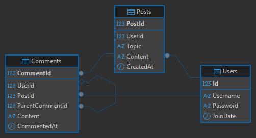
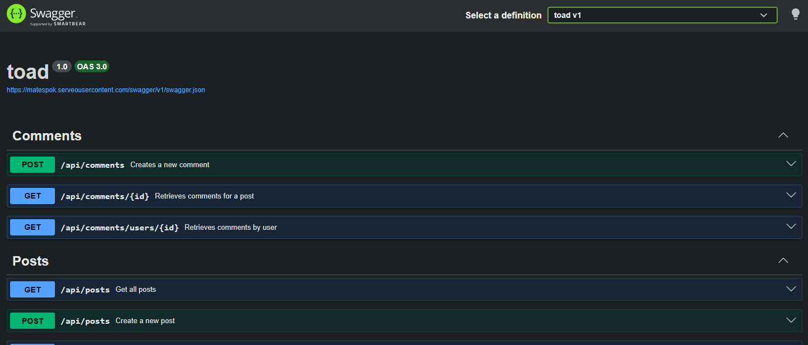

# Croak — Čistý prostor pro diskuze

Projekt webové aplikace s dynamickým obsahem v JavaScriptu, postavený jako **Progressive Web App (PWA)** a komunikující s vlastním backendem přes **REST API**.

---

## 1. Účel aplikace a reálný use-case

### Motivace a účel
**Croak** je minimalistická sociální síť a diskuzní platforma zaměřená na čistou výměnu myšlenek. V dnešní době jsou moderní sítě přeplněné algoritmy pro udržení pozornosti, reklamami a vizuálním šumem. Croak vrací internetovou konverzaci k tomu, kde byla nejlepší: do **přehledných, chronologicky řazených vláken**, kde má váhu každé slovo.

### Smysluplný Use-case
* **Nezávislá výměna názorů:** Uživatelé mohou zakládat témata (vlákna) a diskutovat o nich bez strachu, že jim algoritmus skryje příspěvek, protože nevyvolává dostatečně kontroverzní reakce.
* **Komunitní mikroblogging:** Ideální pro uzavřené komunity, technologické nadšence nebo akademické debaty, kde je prioritou textový obsah a chronologické řazení.
* **Offline čtení:** Díky podpoře PWA a Service Workera si uživatel může pročítat dříve načtená vlákna i během výpadku spojení nebo na cestách v režimu offline.

---

### Popis souborů:

* **`index.html`**: Prezentační stránka s minimalistickým designem, která uživatele seznamuje s vizí platformy a odkazuje na spuštění samotné aplikace.
* **`network.html`**: Obsahuje základní kostru rozhraní (sidebar, navigaci, mobilní menu a hlavní kontejner `#app`), do kterého JavaScript dynamicky vykresluje jednotlivé pohledy.
* **`style.css`**: Kombinuje výhody Tailwind CSS s vlastními doplňky. Definuje tmavé přírodní pozadí s texturou, zakázkové animace (např. vysunutí toast notifikace) a kompletní responzivní chování (skrytí sidebaru na mobilech, spodní navigace).
* **`script.js`**: Srdce aplikace zajišťující asynchronní operace, obsluhu událostí a klientský routing.
* **`sw.js` & `manifest.json`**: Technologické pilíře PWA. Manifest definuje chování po instalaci na plochu (standalone režim, barva lišty `#1a1c1a`), Service Worker implementuje strategii Cache-First pro statické assety.
* Struktura ukládání dat

---

## 2. Seznam API Endpointů

Aplikace komunikuje s vlastním produkčním REST API běžícím na adrese:

`https://matespok.serveousercontent.com/api`

Kompletní technická dokumentace, schémata a možnost testování jednotlivých požadavků se nachází v rozhraní Swaggeru, veškerá dokumentace API na odkaze: `https://matespok.serveousercontent.com/swagger`

---

## 3. Principy fungování aplikace

### 3.1 Klientský Router a Stav (State Management)

Aplikace je navržena jako **SPA (Single Page Application)**. Přechod mezi stránkami (Domů, Detail příspěvku, Profil, Přihlášení) neprovádí fyzický reload prohlížeče. Místo toho objekt `router` v `script.js` zachytává požadavky, mění hodnotu `state.view` a následně asynchronně překresluje obsah elementu `
`.

Globální stav `state` uchovává:

* Aktuální JWT token, ID a jméno přihlášeného uživatele.
* Cache uživatelských jmen (`userCache`), která minimalizuje redundantní API požadavky na backend při zobrazení seznamu příspěvků a autorů.

### 3.2 Lokální úložiště a perzistence dat

Pro splnění podmínek zadání aplikace plně využívá **`localStorage`**:

* Při úspěšné autentizaci se token a uživatelská data bezpečně uloží do prohlížeče.
* Při opětovném načtení stránky se stav automaticky obnoví, uživatel zůstává přihlášen.
* Odhlášení vymaže tyto klíče z `localStorage` a okamžitě resetuje aplikaci do anonymního režimu.

### 3.3 Implementace PWA a Offline podpora

* **Instalace na plochu:** Aplikace poslouchá událost `beforeinstallprompt`. Pokud systém vyhodnotí, že aplikaci je možné instalovat, JavaScript zachytí tento prompt a zobrazí uživateli čistý, na míru nastavený **Toast banner** s nabídkou instalace platformy přímo na plochu zařízení.
* **Service Worker (`sw.js`):** Při prvním spuštění zaregistruje cache `croak-v1` a uloží do ní kritické statické soubory (`network.html`, `manifest.json`). Při výpadku sítě nebo režimu letadlo zachycuje síťové požadavky. Pokud uživatel naviguje napříč aplikací offline, Service Worker podstrčí nacachovanou strukturu, čímž zabrání zobrazení chybové stránky prohlížeče. Stránka navíc vizuálně informuje uživatele o offline režimu pomocí červeného horního fixního banneru.

---
